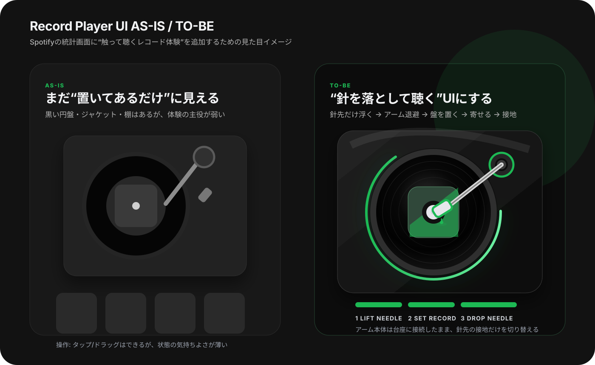
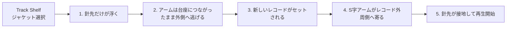

# Record Player UI Realistic Mock

`Shelf Mode` のレコードプレーヤーUIを、添付された上面視のターンテーブル画像に近い比率で、円盤が主役に見えるよう再現するためのデザインメモです。

## 目的

現在の画面には、レコード棚・中央レコード・トーンアーム・プログレス表示の土台があります。次の改善では、見た目を足すだけでなく、**実機っぽいターンテーブルの構造と、円盤を大きく見せつつ筐体内にきれいに収めるレイアウト** を入れます。

## 参考にした見た目

| パーツ | 再現方針 |
|---|---|
| キャンバス | 参考画像に近い横長比率。`900 × 665` で円盤の占有率を上げる |
| 筐体 | シルバー系の横長プレート。ブラシ金属っぽい薄いテクスチャを重ねる |
| プラッター | 画面左側を大きく占める主役として配置しつつ、外周が筐体からはみ出さないサイズにする |
| ストロボドット | プラッター側に印字された点として扱うため、レコード盤と一緒には回転させない |
| レコード | 黒い盤、細い溝、白いセンターラベル、中心スピンドルを描く。回転するのはこの盤部分だけ |
| 左上パーツ | 45アダプター風の小さい金属円を置く |
| 下部スイッチ/ステップ表示 | 盤面と干渉する要素、円盤より下の説明UIは削除する |
| トーンアーム台座 | 右上に大型の円形台座。内側に複数の金属リング・ネジ・支柱を描く |
| トーンアーム | 台座から外れないS字アーム。右上から盤の外周へ伸ばす |
| ヘッドシェル | 黒いカートリッジと緑の針先表示を付ける |
| ピッチスライダー | 右側に縦長スライダーと目盛りを置く |

## 動作イメージ

## アニメーション仕様

| フェーズ | UIラベル | 盤 | トーンアーム | 光/背景 |
|---|---|---|---|---|
| 初期 | `NEEDLE ON THE GROOVE` | 黒いレコード盤だけがゆっくり回転 | 針が盤面に乗っている | 針先が薄く発光 |
| ニードルリフト | `LIFT NEEDLE` | 回転を維持、または少し減速 | アーム本体は台座に接続したまま、針先の接地表示だけを消す | 発光を一段弱める |
| 退避 | `MOVE OUT` | 盤はまだ残る。外周ドットは固定 | 台座を支点にして、S字アームが外周の外へ回避する | 次の盤待ちの雰囲気にする |
| 盤セット | `SET RECORD` | 新しいレコードが上から少し落ちてセットされる | アームは外側で待機。ただし台座からは外れない | ストロボ外周は固定のまま少し明るくなる |
| 寄せ | `MOVE IN` | 新しい盤がゆっくり回り始める | 台座を支点にして、アームがレコード外周側へ寄る | 光を再生状態へ戻す |
| 針落とし | `DROP NEEDLE` | 回転継続 | 針先の接地表示と影を出して、溝に乗ったことを見せる | 針先だけ軽くパルス |
| 再生中 | `NEEDLE ON THE GROOVE` | 黒いレコード盤だけがゆっくり回転 | 曲の進行に合わせて少しずつ内側へ進む | 針先が薄く発光 |
| 一時停止 | `READY ON YOUR SHELF` | 停止 | 現在位置で停止、または軽く戻る | 発光を弱める |
| 失敗 | `NO BROWSER PLAYBACK AVAILABLE` | 停止 | レスト位置 | 赤ではなくグレー寄りで控えめ |

## 実装メモ

### 1. CSS側

- SVGモックは参考画像に近い比率を想定し、`900 × 665` の横長キャンバスにする
- 円盤の占有率を上げつつ、外周が筐体からはみ出さないよう中心位置と半径を調整する
- タイトル帯・下部ステップ表示・盤面に干渉するスイッチは配置しない
- `.record-shelf-stage.is-playing .record-disc` に状態依存の回転演出を寄せる
- プラッター外周は点線リング、盤面は複数の細い円で溝を表現する
- 外周ドットはプラッター側として固定し、 `.record-disc` の回転対象に含めない
- `.record-progress-ring` は単なる枠ではなく、ストロボ外周や再生状態のサインにする
- トーンアームは **台座・S字アーム・ヘッドシェル・針先** を別要素に分ける
- 2D表現ではアーム本体を上下に `translate` しない。浮き沈みは針先の接地表示・影・パルスで表現する
- ピッチスライダーは装飾兼状態表示として使う
- `prefers-reduced-motion: reduce` は維持する

### 2. JS側

- 既存の `updateShelfHero()` で、状態ラベル・選択曲・再生状態をまとめて同期する
- `updateRecordSpinState()` は継続利用し、再生中だけ `requestAnimationFrame` で回す
- `syncTonearmWithPlaybackProgress()` で曲の進行に合わせて針角度を調整する
- `playTrackFromShelf()` の `intent` を利用して、tap/drop/tonearmでラベルと演出を変える
- 曲切り替え時は `liftNeedle → moveArmOut → setRecord → moveArmIn → dropNeedle` の順で状態クラスを切り替える

### 3. 優先順位

1. **まず見た目**: 横長筐体、巨大プラッター、固定ストロボドット、S字アーム、ピッチスライダー
2. **次に動き**: ニードルリフト、外側退避、盤セット、針落とし
3. **最後に操作感**: ドラッグ、針ドラッグ、タップ時のフィードバック、エラー時の表示

## 完成イメージの一言

**「Spotifyのトップ曲ランキング」ではなく、ユーザーのトップ曲を“実機ターンテーブルで盤を替え、針を落として聴く”画面にする。**
