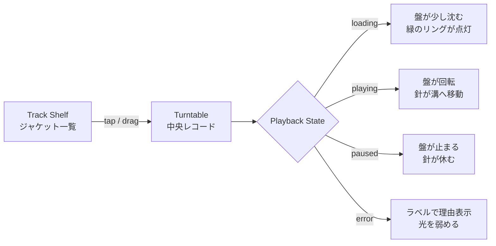

# Record Player UI AS-IS / TO-BE

`Shelf Mode` のレコードプレーヤーUIを、単なる装飾ではなく「針を落として聴く」体験に寄せるためのデザインメモです。

## 目的

現在の画面には、レコード棚・中央レコード・トーンアーム・プログレス表示の土台があります。次の改善では、見た目を足すだけでなく、**再生状態とアニメーションが連動しているUI** にします。

## AS-IS

| 観点 | 現状 |
|---|---|
| 見た目 | レコードプレーヤー風の要素はあるが、やや平面的に見える |
| 操作感 | ジャケットをタップ/ドラッグできるが、反応が控えめ |
| 再生状態 | `PLAYING` / `READY` のテキストはあるが、盤・針・光との連動が弱い |
| アニメーション | 盤回転、ドロップ演出、ドラッグゴーストはあるが、演出の主役が分散している |
| 印象 | Spotify風UIの中にレコード素材を置いた感じで、プレーヤーとしての存在感が弱い |

## TO-BE

| 観点 | 変更方針 |
|---|---|
| 見た目 | 黒い筐体、盤面の溝、反射、スピンドル、針先を強調して質感を上げる |
| 操作感 | ドラッグ中は盤が受け入れ態勢になり、ドロップで光・沈み込み・針移動が起きる |
| 再生状態 | 再生中は盤が回り、針が曲の進行に合わせて少しずつ内側へ進む |
| アニメーション | `drop` / `loading` / `playing` / `paused` / `error` の状態ごとに演出を分ける |
| 印象 | ランキングを見る画面から、「自分のトップ曲をレコードで流している」体験へ寄せる |

## 画面イメージ

## アニメーション仕様

| 状態 | UIラベル | 盤 | トーンアーム | 光/背景 |
|---|---|---|---|---|
| 初期 | `DROP A TRACK ON THE RECORD` | 停止 | レスト位置 | 背景は暗め |
| ドラッグ中 | `DROP TO PLAY` | 受け入れリング点灯 | レスト位置 | ドロップゾーンが軽く拡大 |
| ドロップ直後 | `DROPPED ON THE RECORD` | 0.5秒だけ弾む | 針が盤の外周へ移動 | 緑のパルス |
| 再生中 | `NEEDLE ON THE GROOVE` | ゆっくり回転 | 再生位置に応じて内側へ移動 | リングが薄く発光 |
| 一時停止 | `READY ON YOUR SHELF` | 停止 | 現在位置で停止、または軽く戻る | 発光を弱める |
| 失敗 | `NO BROWSER PLAYBACK AVAILABLE` | 停止 | レスト位置 | 赤ではなくグレー寄りで控えめ |

## 実装メモ

### 1. CSS側

- `.record-shelf-stage.is-playing .record-disc` に状態依存の回転演出を寄せる
- `.shelf-drop-zone.is-drag-over` の光り方を強め、ドロップ可能状態を明確にする
- `.record-progress-ring` は単なる枠ではなく、現在位置/再生状態のサインにする
- `.tonearm .tonearm-pipe` と針先の影を強めて、UIの主役にする
- `prefers-reduced-motion: reduce` は維持する

### 2. JS側

- 既存の `updateShelfHero()` で、状態ラベル・選択曲・再生状態をまとめて同期する
- `updateRecordSpinState()` は継続利用し、再生中だけ `requestAnimationFrame` で回す
- `syncTonearmWithPlaybackProgress()` で曲の進行に合わせて針角度を調整する
- `playTrackFromShelf()` の `intent` を利用して、tap/drop/tonearmでラベルと演出を変える

### 3. 優先順位

1. **まず見た目**: 盤面の質感、針、ドロップゾーン、状態ラベルを強化
2. **次に動き**: ドロップ時の弾み、再生中の盤回転、針の進行
3. **最後に操作感**: 針ドラッグ、タップ時のフィードバック、エラー時の表示

## 完成イメージの一言

**「Spotifyのトップ曲ランキング」ではなく、ユーザーのトップ曲を“レコード棚から選んで、針を落として聴く”画面にする。**
